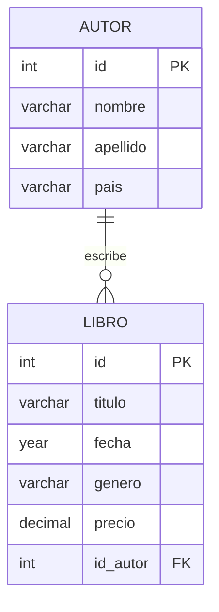

# Biblioteca · Autores y libros

Base de datos relacional desarrollada con **MySQL** para practicar la creación de tablas, relaciones, inserción de datos y consultas de agregación.

## Modelo de datos

La biblioteca está formada por dos entidades:



Un autor puede escribir varios libros y cada libro pertenece a un autor mediante la clave foránea `id_autor`.

## Contenido

| Elemento | Descripción |
| --- | --- |
| **6 autores** | Con nombre, apellido y país de origen |
| **10 libros** | Con título, año, género, precio y autor |
| **1 relación 1:N** | `autor.id` → `libro.id_autor` |
| **Consultas SQL** | Agregaciones, medias, totales y agrupaciones |

## Estructura del proyecto

| Archivo | Contenido |
| --- | --- |
| [`creacion _tablas.sql`](creacion%20_tablas.sql) | Crea las tablas `autor` y `libro` |
| [`insercion_datos.sql`](insercion_datos.sql) | Inserta los autores y libros de ejemplo |
| [`consultas_ejercicio1.sql`](consultas_ejercicio1.sql) | Consultas con funciones de agregación |
| [`consultas_ejercicio2.sql`](consultas_ejercicio2.sql) | Consultas con `GROUP BY` |

## Cómo ejecutarlo

1. Abre MySQL Workbench y crea o selecciona una base de datos, por ejemplo:

   ```sql
   CREATE DATABASE libreria;
   USE libreria;
   ```

2. Ejecuta los scripts en este orden:

   1. [`creacion _tablas.sql`](creacion%20_tablas.sql)
   2. [`insercion_datos.sql`](insercion_datos.sql)
   3. [`consultas_ejercicio1.sql`](consultas_ejercicio1.sql)
   4. [`consultas_ejercicio2.sql`](consultas_ejercicio2.sql)

## Consultas practicadas

### Funciones de agregación

- Precio medio de todos los libros.
- Número total de libros.
- Precio máximo y mínimo.
- Suma de todos los precios.

### Agrupaciones con `GROUP BY`

- Número de libros escritos por cada autor.
- Número de libros por género.
- Precio medio por género.
- Precio medio de los libros de cada autor.

## Tecnologías

- MySQL
- MySQL Workbench
- Modelo EER
